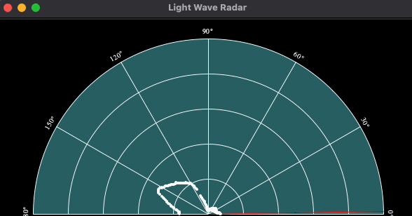

# Arduino Airport Surveillance Radar

Fall 2023 by Thiago Ferreira

## Project


## Run Python Server

Make sure you have the latest python install on your computer. Access https://www.python.org/downloads/

Install all dependencies

```sh
pip3 install -r requirements.txt
```

Then run:

```sh
python3 main.py
```

If everything is correct, then you should be able to see the following screen:

